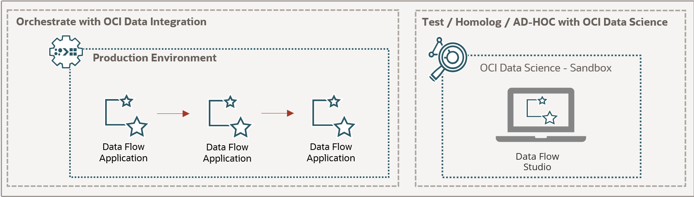

# Data Engineering using Jupyter Notebooks

### Using OCI Data Science Service as a development platform for Data Engineering and interaction with Oracle Cloud Services

* OCI Data Flow - Apache Spark managed on Oracle Cloud
* OCI Data Science - Jupyter notebook based service for Data Scientists on Oracle Cloud
* Data Flow Studio - Using OCI Data Science to interact easily with OCI Data Flow for Test / Homolog / AD-HOC

I am using Data Flow Studio to explore the possibilities of my code before sending to OCI Data Flow Application to be executed. It is very useful to test and modify your code and see the results before you send to "Production"

